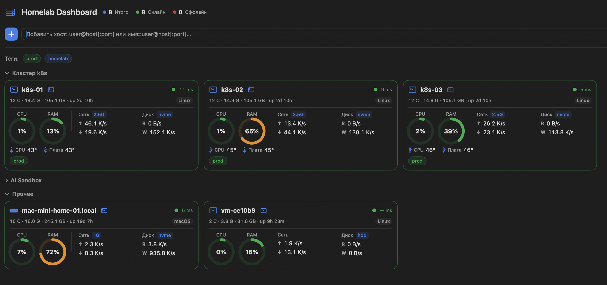

# homelab-dashboard

Нативный macOS-дашборд (Apple Silicon / ARM) для мониторинга Linux и macOS-серверов по SSH:
живые метрики, группы, цветные теги, светлая/тёмная тема, YAML-конфиг с hot-reload. **Ноль внешних зависимостей.**

A native macOS (Apple Silicon) SSH-based dashboard for monitoring your Linux and macOS servers:
live metrics, groups, colored tags, light/dark theme, and a YAML config with instant hot-reload.
**Zero external dependencies** — own YAML parser and test runner, system SSH/Ping only.

## Скриншот / Screenshot



## Особенности / Features

- Live pull-мониторинг по SSH (на серверах ничего не устанавливается)
- Метрики: статус, ping, cores, RAM, диск (тип + объём), uptime, температура, CPU %, RAM %, сеть ↑/↓, диск I/O R/W
- Бейджи: аплинк (100/1G/2.5G/10G) и тип диска (nvme/ssd/hdd)
- Сводка: Итого / Онлайн / Оффлайн
- Группы (секции) и цветные теги-фильтры; правый клик / drag-and-drop для группировки
- Светлая / тёмная тема (system | light | dark)
- YAML-конфиг с мгновенным hot-reload; контекстное удаление хоста; консоль действий/ошибок; кнопка терминала `›_`
- Только ARM (Apple Silicon), ноль внешних зависимостей

## Требования / Requirements

- macOS 13+
- Apple Silicon (arm64)
- `ssh` и `ping` из консоли; серверы авторизованы через `~/.ssh` (ключи / config)

## Сборка / Build

```sh
swift build            # debug build
swift run Check        # self-contained test runner (без XCTest)
swift build -c release # release build
```

## Запуск / Run

```sh
HOMELAB_CONFIG=/path/config.yaml .build/release/Dashboard
# по умолчанию (macOS): ~/Library/Application Support/homelab-dashboard/config.yaml
#  (fallback: ~/.config/homelab-dashboard/config.yaml)
```

## Конфигурация / Configuration

Пример: `config.example.yaml` (заглушки). Обязательны только `name` и `ssh`; ОС определяется
автоматически, метрики собираются все, недоступные — `N/A`. Реальные адреса — только в приватном
`config.yaml` (в `.gitignore`), в публичный репозиторий не попадают.

Формат `ssh`: `[user@]host` или `[user@]host:port` (порт → `ssh -p <port>`). Имя карточки
задаётся префиксом `имя=address` (напр. `vm2=user@h:2222`); по умолчанию берётся из адреса —
для джамп-хостов вида `user:alias@host` — из `alias` (реальная VM за бастионом), иначе из host.
Имя (`name`) должно быть уникальным; заголовок на дашборде — системный hostname хоста.

## Спецификация

Полное описание устройства: **`SPEC.md`** (архитектура, схема YAML, команды сбора, UI,
цветовая семантика порогов, hot-reload, безопасность).

## Лицензия / License

[MIT](LICENSE)
